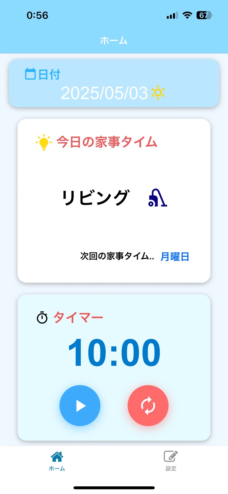
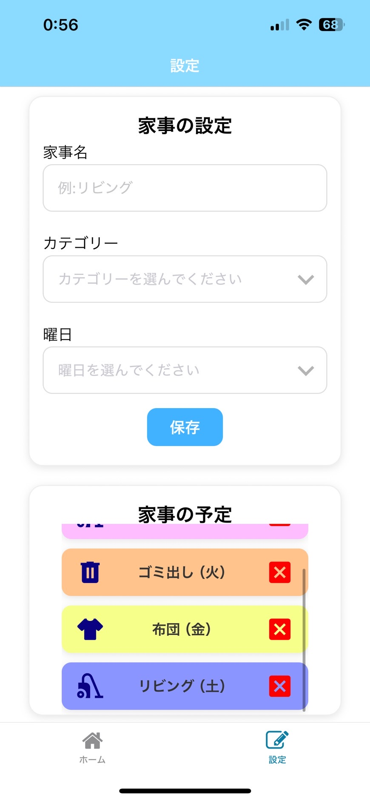

# 1.アプリ名
「家事タイム」 – 家事の予定を簡単に管理するモバイルアプリ

# 2.概要
　家事のスケジュール管理が煩雑になりがちな家庭だけでなく、一人暮らしで部屋の管理をつい忘れてしまいがちな人にも向けて、シンプルかつ見やすいUIで家事の予定を手軽に管理できるアプリを作成した。
フレームワークはReact Nativeを使用し、開発期間は約2週間で、主に夜間や週末に個人で取り組んだ。

# 3.使用技術
### フレームワーク・言語
- React Native(Expo)
- JavaScript（ES6）
### UI・ナビゲーション
- React Navigation（タブナビゲーション）
- @expo/vector-icons（アイコン表示）
- react-native-picker-select（ドロップダウン選択）
### 状態管理・React構文
- React Hooks（useState, useEffect）
- React Context API（グローバル状態の共有）
- props（親子コンポーネント間のデータ受け渡し）
### 外部連携・API
- OpenWeatherMap API（天気取得）
- expo-location(端末の現在地の取得)
### その他ユーティリティ
- react-native-uuid（ユニークID生成）
- AsyncStorage（ローカルストレージ）

# 4.主な機能

- 家事の追加（家事名の入力、カテゴリー、曜日を指定）
- 今日の家事の内容、次回の家事が何曜日にあるかをホーム画面に表示
- 今日の日付、今日の天気をホーム画面に表示
- 家事をする際に手軽に使用できる10分タイマー
- 曜日順に自動で並び替えられる家事リスト
- 曜日ごとに色分けされたリスト
- 非同期ストレージを用いたリストの状態管理

# 5.工夫した点、課題解決

### [uuidの導入による、FlatListの安定性の向上]
#### 背景・課題
　家事管理アプリのタスク一覧を表示する際、FlatListコンポーネントを用いてリストをレンダリングした。当初、リストのkeyにindexを使用していたため、スクロール中にタスクを削除すると意図しない別のタスクが削除されるバグが発生した。
#### 解決策
　各タスクにランダムな一意のID（UUID）を付与し、以下のようにリストの識別子として使用した。

```
import uuid from 'react-native-uuid';

setHouseworkList([...houseworkList, { id: uuid.v4() ,text, category, week }]);
```
```
<FlatList
   data={[...houseworkList].sort((a, b) => {
      const weekOrder = {
         '月曜日': 0,
         '火曜日': 1,
         '水曜日': 2,
         '木曜日': 3,
         '金曜日': 4,
         '土曜日': 5,
         '日曜日': 6,
         };
         return weekOrder[a.week] - weekOrder[b.week];
      })}
      renderItem={renderItem}
      keyExtractor={(item) => item.id.toString()} 
      contentContainerStyle={{ paddingTop: 20 }}
/>
```

また、削除操作でも index ではなく id を基準にすることで、誤削除のリスクをなくした。

#### 成果
　スクロール中でも安定して正しいタスクが削除されるようになった。

### [Context APIとAsyncStorageを用いた状態管理の改善]
#### 背景・課題
　当初は家事リスト（houseworkList）の状態を useState により個別画面ごとに管理しており、他の画面とデータを共有することができなかった。そのため、設定画面で保存された家事リストをホーム画面に表示されず、リストの連携ができないといった問題があった。
#### 解決策
　ReactのContext APIを導入し、状態をアプリ全体で共有可能な構成に変更した。加えて、非同期ストレージであるAsyncStorageを組み合わせることで、ユーザーが追加・削除した家事データを永続化し、アプリの再起動後も状態を維持できるようにした。

```
//Context APIの要点コード

const HouseworkContext = createContext(null);

export const HouseworkProvider = ({ children }) => {
  const [houseworkList, setHouseworkList] = useState([]);

  return (
    <HouseworkContext.Provider value={{ houseworkList, setHouseworkList }}>
      {children}
    </HouseworkContext.Provider>
  );
};

export const useHousework = () => useContext(HouseworkContext);
```
```
//AsyncStorageの要点コード

const STORAGE_KEY = 'houseworkList';

//読み込み処理
const loadFromStorage = async () => {
    try {
      const jsonValue = await AsyncStorage.getItem(STORAGE_KEY);
      if (jsonValue != null) {
        setHouseworkList(JSON.parse(jsonValue));
      }
    } catch (e) {
      console.error('読み込みに失敗しました', e);
    }
  };

//保存処理
const saveToStorage = async (item) => {
    try {
      const jsonValue = JSON.stringify(item);
      await AsyncStorage.setItem(STORAGE_KEY, jsonValue);
    } catch (e) {
      console.error('保存に失敗しました', e);
    }
  };

useEffect(() => {
  loadFromStorage(); // 読み込み
}, []);

useEffect(() => {
  saveToStorage(houseworkList); // 保存
}, [houseworkList]);
```

#### 成果
　ホーム画面で、Context経由で家事リスト(houseworkList)にアクセスし、今日の家事の表示や次回の予定日の算出を可能となった。、また、アプリ再起動後もユーザーの設定が保持されるため、利便性が向上した。

### [位置情報を利用した天気情報の取得機能の実装]
#### 背景・課題
　ユーザーにその日の家事を促すためには、当日の環境情報を提供することで、よりパーソナライズされたアプリができると考えた。特に洗濯など天候に左右されやすい家事では、天気情報の有無が重要なため、天気情報を取得することを考えた。
#### 解決策
　React Nativeのexpo-locationを用いて位置情報を取得し、OpenWeatherMap APIを使用してその地点の天気をリアルタイムで取得する処理をuseEffectで実装した。
```
useEffect(() => {
   const fetchWeather = async () => {
         let { status } = await Location.requestForegroundPermissionsAsync();
         if (status !== 'granted') return;

            let location = await Location.getCurrentPositionAsync({});
            const { latitude, longitude } = location.coords;

            const response = await fetch(
                `https://api.openweathermap.org/data/2.5/weather?lat=${latitude}&lon=${longitude}&appid=APIキー&units=metric&lang=ja`
            );
            const data = await response.json();
            setWeather(data);
      };
      fetchWeather();
    }, []);
```
また、取得した天気情報の種類（晴れ、曇り、雨など）に応じて、アイコンを切り替えて表示することで視覚的に情報を伝える直感的なUIを実現した。
#### 成果
　アプリ起動時にユーザーの現在位置から天気情報が自動で表示されるようになり、その日の家事を計画する際の参考になる情報を提供できた。
これにより、ユーザーは日々の生活環境に即した行動が取りやすくなり、アプリの利便性が向上した。

# 6.スクリーンショット





# 7.まとめ
　本アプリ「家事タイム」は、日々の家事を効率よく管理し、生活の質を高めることを目的に開発した。開発を通して、状態管理（Context APIとAsyncStorageの併用）や外部APIとの連携（OpenWeatherMap、位置情報取得）など、実用的な技術スキルを身につけることができた。また、バグの発見と解決を繰り返すことで、デバッグ力や問題解決力が向上し、React Nativeにおけるコンポーネント構造や状態管理、非同期処理の理解も深まった。今後は、通知機能や共有機能などの追加機能も検討し、より便利で継続的に使いたくなるアプリに成長させていきたい。
